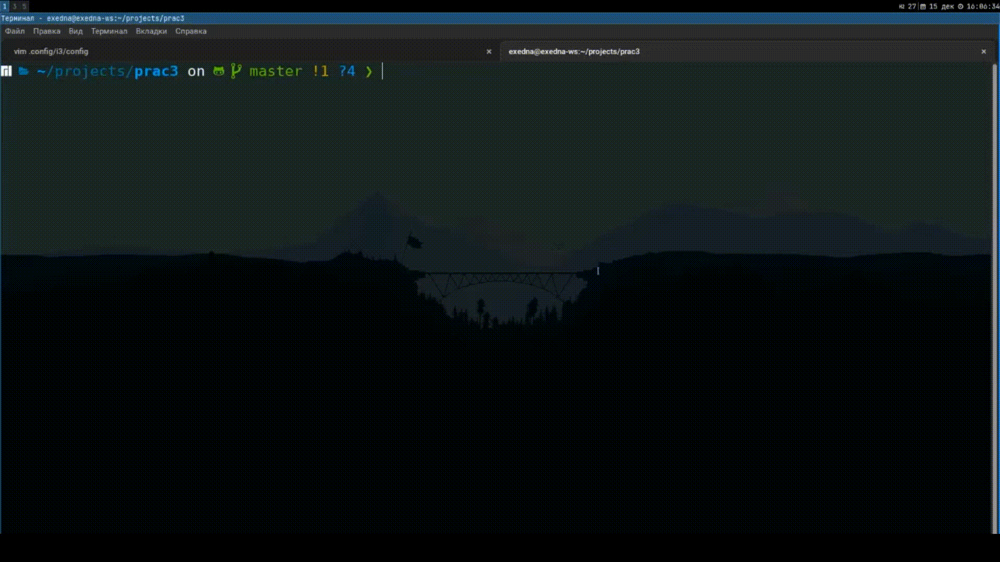

# 3-й практикум. Консольные Шахматы.

## Установка
> `git clone https://github.com/exifna/prac3`
> 
> `cd prac3`

## ***Установка зависимостей*** 
> `python -m pip install inputimeout`

## ***Запуск***
> `python chess.py`

## ***Файлы***
>> **figurs.py** - здесь собраны классы фигур. Все классы наследуются от главного класс Figura и имеют поля `isWhite`, `figura_type` и `symbol`. Поле `steps` необходимо исключительно для пешек, чтобы можно было проверять может ли она ходить на 2 клетки вперёд.
>
>> **tools.py** - тут находится класс поля, класс, необходимый для определения типа фигуры и основной класс, от которого наследутся все классы фигур.
>
>> **chess.py** - основной файл, отвечающий за игру. Именно в нём игроки вводят место, куда хотят переместится.

## ***Иная информация о работе проекта***
- Ввод принимает 4 символа, первые 2 из которых - начальная координата, конечные - координата переноса.
- При вводе координат перемещения, начальная и конечная координата могут быть разделенный любым символом (его может и не быть) 
- На ввод игроку даётся 10 секунд, если не успевает - то ход делает следующий игрок.
- Если был произведён некорректный ввод или ход невозможен, то ход делает другой цвет
- Таблицей является двумерный массив, состоящий из null-значений и объектов фигур
- Метод для проверки возможности хода находится в классе таблицы, а не в каждом классе фигуры. Это делает работу скрипта более оптимизированной и интуитивно понятной при анализе кода.

## ***Демо***

### Видео в не очень хорошем качестве

